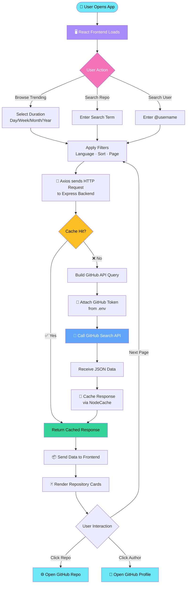
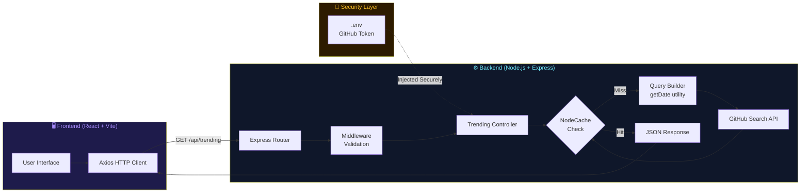
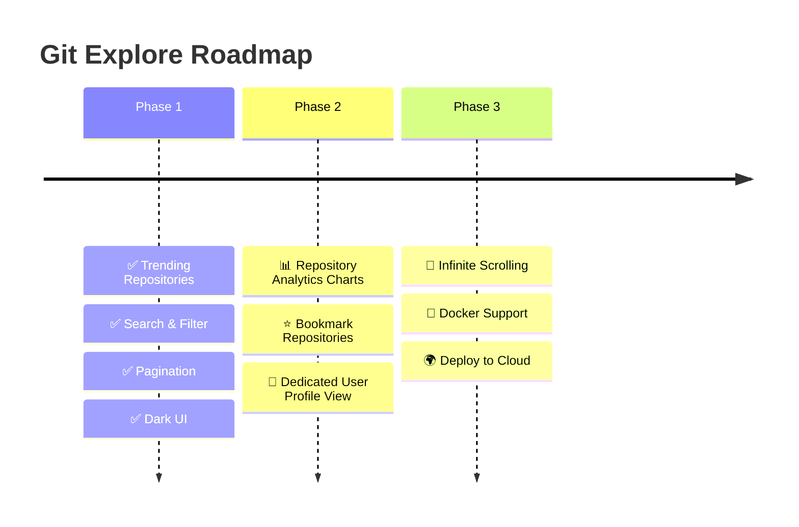

<div align="center">

<!-- TOP WAVE -->


<br/>

<!-- BADGES -->


</div>


## 🌟 Overview

**Git Explore** is a modern full-stack web application that fetches and displays trending GitHub repositories using the GitHub Search API. Explore trending repos, search projects, filter by duration and language, and directly open repositories or user profiles — all through a sleek, dark-themed UI.


## ✨ Features

<div align="center">

| Feature | Description |
|---------|-------------|
| 🔥 **Trending Repos** | Day / Week / Month / Year filters |
| ⭐ **Smart Sorting** | Sort by Stars, Forks, or Recently Updated |
| 🔎 **Search** | Search repos by name or description |
| 👤 **User Search** | Search GitHub users using `@username` |
| 📄 **Pagination** | API-safe pagination support |
| 🌙 **Dark UI** | Premium dark themed interface |
| ⚡ **Server-Side API** | Secure GitHub API integration |
| 🔐 **Token Security** | GitHub Token never exposed to frontend |
| 🧠 **Caching** | Server-side response caching |

</div>


## 🏗️ Tech Stack

<div align="center">

### 🖥️ Frontend
<br/>


### ⚙️ Backend
<br/>


### 🛠️ Tools & Dev
<br/>


</div>


## 📂 Project Structure

```
Git-Explore/
│
├── 📁 backend/
│   ├── 📁 src/
│   │   ├── 📁 controllers/
│   │   │   └── 📄 trendingController.js
│   │   ├── 📁 routes/
│   │   │   └── 📄 trendingRoutes.js
│   │   ├── 📁 utils/
│   │   │   └── 📄 getDate.js
│   │   └── 📄 app.js
│   ├── 📄 server.js
│   └── 📄 package.json
│
├── 📁 frontend/
│   ├── 📁 src/
│   │   ├── 📁 components/
│   │   │   ├── 🧩 RepoCard.jsx
│   │   │   ├── 🧩 Filters.jsx
│   │   │   ├── 🧩 Pagination.jsx
│   │   │   ├── 🧩 Navbar.jsx
│   │   │   └── 🧩 Loader.jsx
│   │   ├── 📁 pages/
│   │   │   └── 🗒️ Home.jsx
│   │   ├── 📁 services/
│   │   │   └── 📄 api.js
│   │   └── 📄 App.jsx
│   └── 📄 package.json
│
└── 📄 README.md
```


## 🔄 How It Works — Application Flow




## 🔧 Backend Architecture Flow




## 📌 API Reference

```http
GET /api/trending
```

<div align="center">

| Parameter | Type | Options | Description |
|-----------|------|---------|-------------|
| `duration` | `string` | `day` `week` `month` `year` | Trending time window |
| `limit` | `number` | `1–100` | Results per page |
| `page` | `number` | `1–10` | Pagination page |
| `language` | `string` | e.g. `javascript` | Filter by language |
| `sort` | `string` | `stars` `forks` `updated` | Sort order |
| `search` | `string` | any term | Search keyword |

</div>

**Example Request:**
```http
GET /api/trending?duration=week&limit=10&page=1&language=javascript&sort=stars
```


## ⚠️ GitHub API Limitations

> [!WARNING]
> - GitHub Search API restricts results to the **first 1000 entries**
> - Pagination is capped at **10 pages** to prevent API overflow errors
> - Unauthenticated requests are limited to **10 req/min** — always use a token!


## 🔐 Security

> [!NOTE]
> - GitHub Personal Access Token stored securely using **environment variables**
> - `.env` files are excluded via `.gitignore`
> - Token is **never exposed** to the frontend client
> - All API calls are proxied through the backend


## 💡 Future Enhancements




<!-- BOTTOM WAVE -->
<div align="center">

</div>
